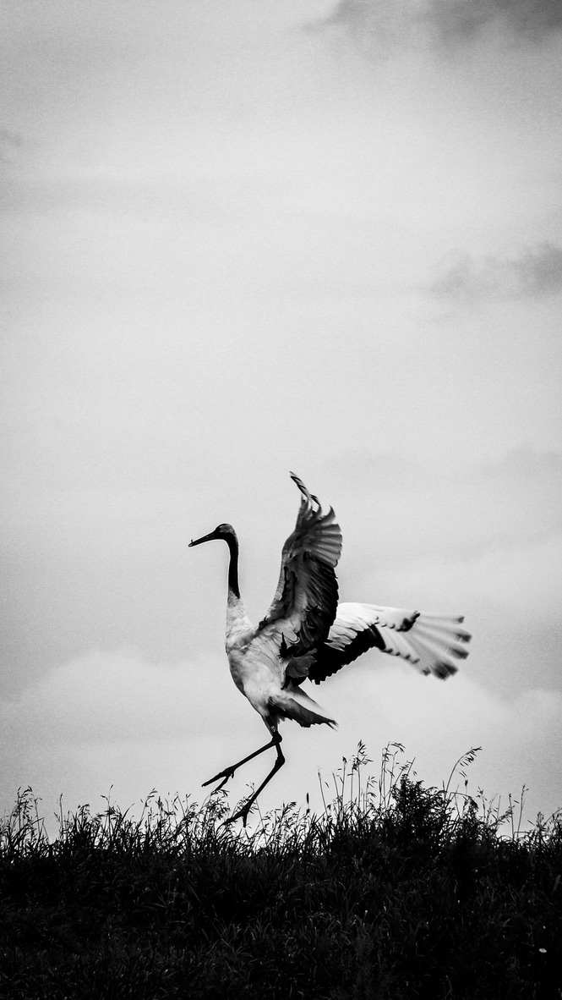

### Hi there 👋

#### About me

  

I am a young Chinese who is currently working in the field of gopher and crypto  . I know English but I don’t use it often so I’m not proficient enough. I plan to pass IELTS📝 by the end of next year🔥. At the same time, I am an outdoor activity enthusiast 🧗, like photography 📷, talk about technology and humanities with people, and share the scenery of the world. Finally, **World Peace**! 🗺 ☮

🔥 **Break down, calm down, recover, make a comeback, there is nothing new, just a few days of rest is enough, it will be boring if you delay it for too long, anyway, you have to give up, or persist, there are only two results. If I would give up, I would not be able to wait until today.**

- 🔭 Interested in algorithm. Recent major in mathematics.
- 🎓 Bachelor of Science in Network Engineering.
- 🌱 I’m currently learning Math, Cryptography and English.
- 🖥 With 4 years' network engineering education and 2 years' development working experience.

---
